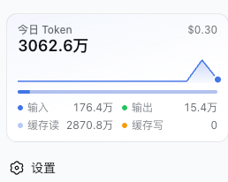
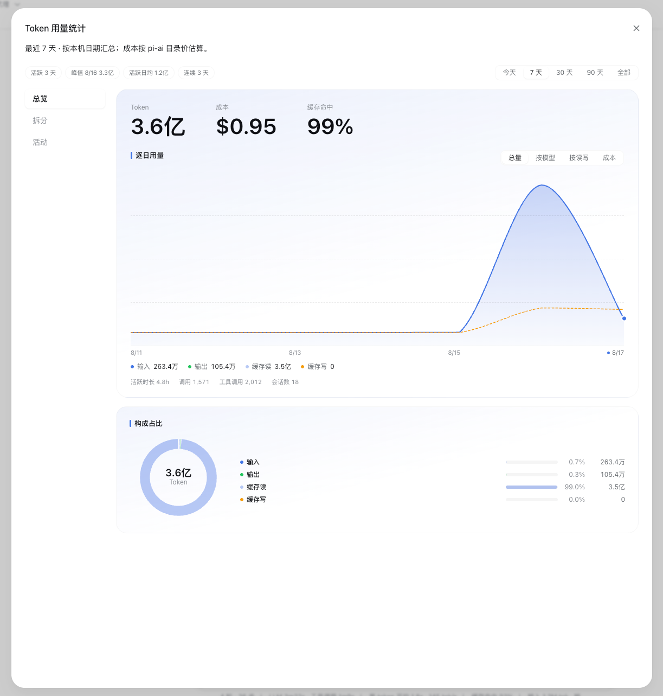
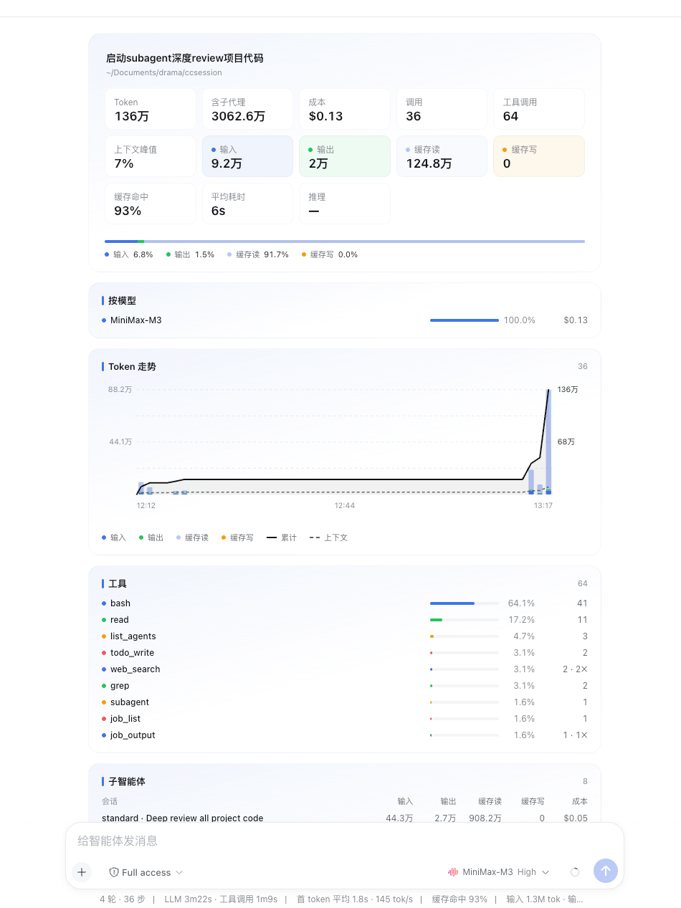

# dsh-providers

**English** · [简体中文](README.zh.md)

Model providers for [DeepSeek Harness](https://github.com/deepseek-ai/deepseek-harness): OAuth/API-key sign-in, token refresh, live model catalogs, and token usage statistics. Built on [`@earendil-works/pi-ai`](https://www.npmjs.com/package/@earendil-works/pi-ai) and [`@lobehub/icons`](https://github.com/lobehub/lobe-icons).

## Install

```sh
dsh plugin --profile web add github:tyql688/dsh-providers
```

The first `add` often exits with `ERR_PNPM_IGNORED_BUILDS` for `@google/genai` and `protobufjs` (pi-ai pulls them; this plugin does not run their install scripts). Deny both and repeat the same add so dsh mounts the bundle:

```sh
dsh plugin --profile web approve-builds '!@google/genai' '!protobufjs'
dsh plugin --profile web add github:tyql688/dsh-providers
```

Or from a local clone:

```sh
git clone https://github.com/tyql688/dsh-providers.git
cd dsh-providers
pnpm install
dsh plugin --profile web add "$PWD"
```

Uninstall:

```sh
dsh plugin --profile web remove dsh-providers
```

## Usage

Run `dsh web`, open **Settings → Accounts** to sign in, update model catalogs, or read an OpenAI-compatible endpoint:


Providers (pi-ai 0.84.2):

- **OAuth**: Anthropic, GitHub Copilot, Kimi For Coding, OpenAI Codex, OpenRouter, Radius, xAI
- **API key**: Amazon Bedrock, Ant Ling, Azure OpenAI, Baseten, Cerebras, Cloudflare AI Gateway, Cloudflare Workers AI, DeepSeek, Fireworks, Google, Google Vertex AI, Groq, Hugging Face, MiniMax / MiniMax CN, Mistral, Moonshot AI / CN, NVIDIA, OpenAI, OpenCode Zen / Go, Qwen Token Plan (×3), Together, Vercel AI Gateway, Xiaomi (×4), Z.AI / Z.AI Coding CN

The sidebar gains a **Tokens today** card; clicking it opens the usage statistics dialog, and each session gets a **统计** tab (its headline figures cover the session itself and reconcile with the composer's meter; subagents are listed and rolled up separately):







Storage: OAuth tokens in `$DSH_HOME/auth.json`, API keys in `.credentials.yaml`, catalog cache in `model-catalog.json`, routes in `settings.yaml`. Environment keys are never stored.

Verified against `@deepseek-ai/dsh@0.1.0-rc.7`, Node 22+.

## Development

```sh
pnpm install
pnpm build     # rebuild lib/ (committed) with any source change
pnpm check     # oxlint + tsc + knip
```
