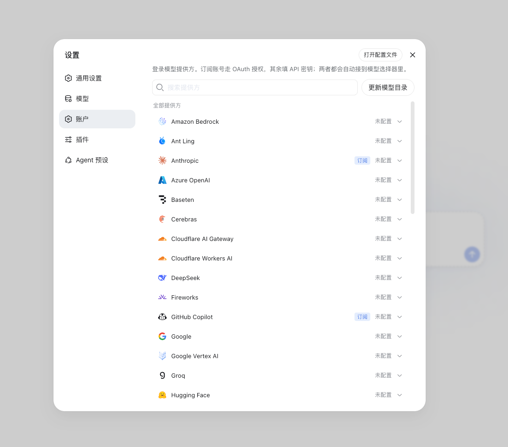

# dsh-providers

[English](README.md) · **简体中文**

给 [DeepSeek Harness](https://github.com/deepseek-ai/deepseek-harness) 补上模型提供方管理:OAuth / API 密钥登录,模型目录保持最新。dsh 本身没有 OAuth、模型清单随发版冻结;本插件补上登录流程、令牌自动刷新和实时目录,不改 dsh 任何包。基于 [`@earendil-works/pi-ai`](https://www.npmjs.com/package/@earendil-works/pi-ai) 与 [`@lobehub/icons`](https://github.com/lobehub/lobe-icons)。

## 安装

```sh
dsh plugin --profile web add github:tyql688/dsh-providers
```

仓库自带构建好的 `lib/`,安装过程不执行任何构建脚本。也可本地 clone:

```sh
git clone https://github.com/tyql688/dsh-providers.git
cd dsh-providers
pnpm install
dsh plugin --profile web add "$PWD"
```

卸载(建议先在账户页退出 OAuth 登录并勾选移除路由):

```sh
dsh plugin --profile web remove dsh-providers
```

## 使用

`dsh web`,打开**设置 → 账户**:



| 操作 | 说明 |
|---|---|
| **登录** | OAuth 或 API 密钥;成功即写好路由,模型直接进选择器 |
| **更换 API 密钥** | 从空输入框开始;点小眼睛可看到当前已存密钥。OAuth 令牌与环境变量值不会发回浏览器 |
| **更新模型目录** | 从 pi.dev 拉取模型清单并重写路由;顶部按钮管全部已路由提供方,卡片按钮只管自己 |
| **从端点获取…** | 读 OpenAI 兼容的 `/v1/models` 清单并采用 |
| **退出登录** | 删除凭据;路由默认保留(可勾选一并删除) |

存储:OAuth 令牌在 `$DSH_HOME/auth.json`(`0600`),API 密钥在 `.credentials.yaml`(dsh「模型」页写的同一文件),目录缓存在 `model-catalog.json`(可随意删),路由在 `settings.yaml` 的 `llm-pi-ai.providers.<id>`。环境变量里的密钥仍归你:只报告为环境提供,不会被存储。

行配置项:`authPath`、`catalogPath`、`catalogBaseUrl`、`autoRoute`(默认 true)。

已知限制:多协议提供方会拆成多条路由(`xai` + `xai-responses`,同一份凭据)。鉴权形态复杂的凭据(多个请求头、附加环境值,如 Cloudflare)不能建路由——dsh 路由只承载单一凭据字符串;登录本身会成功并保留凭据,报错会说明原因。

验证环境:`@deepseek-ai/dsh@0.1.0-rc.6`、`@deepseek-ai/cordis@4.0.1`、Node 22+。

## 开发

```sh
pnpm install   # 装依赖
pnpm build     # 构建 lib/——已提交进仓库,改完源码要重新构建并随源码一起提交
pnpm check     # oxlint + tsc + knip
```

内部结构,一段话:bundle 把基础 `credentials` 行换成继承 `dsh-credentials-local` 的实现(原层级优先级不变,顶上加账户层),页面路由走本插件自己的 `/dsh-providers`,仅回环同源——dsh 的 API 网关对外部插件封闭。本插件与自带 `dsh-llm-pi-ai` 各持一份 `pi-ai`:这份管登录与提供方列表,适配器那份管线上协议;openai-completions / openai-responses / anthropic-messages 之外的协议走适配器自己的目录。
